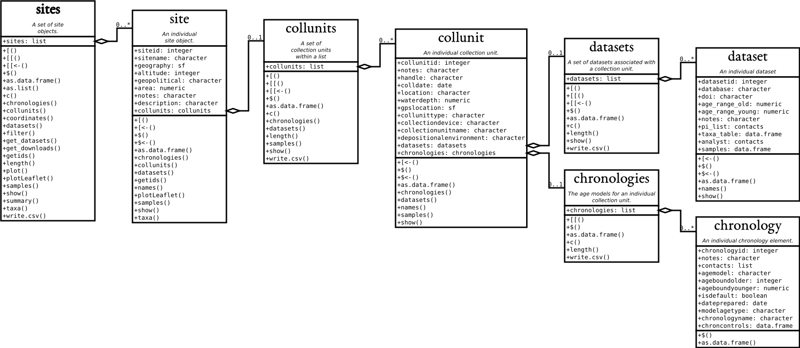

# The `neotoma2` package {#sec-neotoma2}

## Background

This chapter gives you hands-on practice with the `neotoma2` R package [@goring2015], both for
practical reasons and for the insight it gives into how open-data systems work. It is a
condensed version of the [Neotoma workshop](https://github.com/NeotomaDB/Current_Workshop),
focusing on the data structures and the core functions for downloading and manipulating data.
A hard-won lesson for any practising data scientist is how much time and attention go into
data handling.

If you plan to work with Neotoma beyond this book, the
[Slack workspace](https://join.slack.com/t/neotomadb/shared_invite/zt-cvsv53ep-wjGeCTkq7IhP6eUNA9NxYQ)
has a channel for questions about the R package, and you can
[contact us](mailto:neotoma-contact@googlegroups.com) to join the Google Groups mailing list.

In this chapter you will learn how to:

- Search for sites by name and by geographic area

- Filter those results by dataset type and by age

- Obtain the sample data for the datasets you selected

- Harmonise taxon names into groups you can analyse

## Getting started with `neotoma2`

The primary purpose of `neotoma2` is to pass data from the Neotoma Paleoecology Database (Neotoma DB) server into your local R environment. `neotoma2` has a layered structure of core functions for obtaining data:

1. sites
2. datasets
3. downloads
4. samples

There are many more functions for manipulating data and conducting other operations that we will encounter along the way while we take you through these four data layers. For this chapter we use several packages, including `leaflet` and `sf`. We load them with the `pacman` package, which installs anything you do not already have.

::: {.callout-note}
# Packages required for this section

```{r neotomaPackages}
#| output: false
# Load up the package
if (!require("pacman")) install.packages("pacman", repos="http://cran.r-project.org")
pacman::p_load(dplyr, ggplot2, neotoma2, sf, geojsonsf, leaflet, DT, htmlwidgets, readr, stringr)
```
:::

### What the package is actually doing {#sec-apis}

`neotoma2` is a thin wrapper around an [application programming interface](https://en.wikipedia.org/wiki/API),
or API. Every function that fetches something builds a web address, sends it to Neotoma's
servers, and parses the reply. Nothing more mysterious than that.

You can see the whole mechanism by looking at the address. When you call
`get_sites(sitename = "Devils Lake")`, the package assembles this and requests it:

<https://api.neotomadb.org/v2.0/data/sites?sitename=Devils%20Lake>

**Open that link.** Your browser will show the raw reply, a block of
[JSON](https://en.wikipedia.org/wiki/JSON) beginning `{"status":"success","data":[...`, and
inside it you will find `"siteid":666` along with the site description and coordinates. That is
precisely what `get_sites()` receives and turns into a `sites` object for you.

Two details in that address are worth noticing, because they explain behaviour you will meet
later:

- The `%20` stands for the space in "Devils Lake". Addresses cannot contain spaces, so
  characters outside a small permitted set are written as `%` followed by a code. The wildcard
  search `sitename = "%Devil%"` therefore travels as
  <https://api.neotomadb.org/v2.0/data/sites?sitename=%25Devil%25>, because the percent sign
  itself has to be encoded, as `%25`. Try that one too and compare the results.
- Everything you ask for has to fit in the address. Web addresses have a length limit, which is
  why very long or intricate spatial searches fail rather than being sent, as we will see in
  the next section.

Because the data live on someone else's server, your code depends on that server being
reachable. If a call fails for no apparent reason, check the service before debugging your own
code: `neotoma2::pingNeotoma()` returns a status of 200 when the API is answering, and anything
else, or a timeout, means the problem is not in your script. Neotoma does occasionally go down
for maintenance, which is one reason this book saves downloaded data into `data/` rather than
fetching it afresh on every run.

### Good coding practice: explicitly naming packages and functions

Different packages in R are created independently by different teams of developers, and it's very common for two different packages to use the same function names. This can lead to coding errors if you call a function that you know is in one package, but R guesses wrongly that you wanted a function of the same name from an entirely different package. For example, for a function like `filter()`, which exists in both `neotoma2` and other packages such as `dplyr`, you may see an error that looks like:

::: {.callout-warning}
# Oh no! :scream:

```r
Error in UseMethod("filter") :
 no applicable method for 'filter' applied to an object of class "sites"
```
:::

You can avoid this error by explicitly naming which package has the function that you want to use, through the standard convention of double colons (`package.name::function.name`). For example, using `neotoma2::filter()` tells R explicitly that you want the `neotoma2` version, not one belonging to another package.

## Finding sites with `get_sites()`

Many users of Neotoma first want to search and explore data at the site level. There are several ways to find sites in `neotoma2`, but we think of `sites` primarily as spatial objects. They have names, locations, and are found within geopolitical units. However, sites themselves do not have associated information about taxa, dataset types, or ages. `sites` instead are simply the container into which we add that information. So, when we search for sites we can search by:

- siteid
- sitename
- location
- altitude (maximum and minimum)
- geopolitical unit

### Searching by site name

We may know exactly what site we're looking for (*"Devil's Lake"*), or have an approximate guess for the site name (for example, we know it's something like *"Devil Pond"*, or *"Devil's Hole"*).

We use the general format: `get_sites(sitename="XXXXX")` for searching by name.

PostgreSQL (and the API) uses the percent sign as a wildcard. So `"%Devil%"` would pick up "Devils Lake" for us (and would pick up "Devil's Canopy Cave"). Note that the search is case-insensitive, so `"%devil%"` will work. Note also that Neotoma spells this particular site without an apostrophe, which is why the wildcard is useful.

If we want an individual record we can use the `siteid`, which is a unique identifier for each site: `devils_lake <- neotoma2::get_sites(siteid = 666)`.

::: {.callout-tip}
# Good practice tip

Every call to `get_sites()`, `get_datasets()` and `get_downloads()` goes over the network to
the Neotoma servers. Re-running them on every attempt is slow, and it puts needless load on a
shared community resource. So from here on we save each result into `data/` the first time and
read it back afterwards. The `if (!file.exists(...))` wrapper around the calls below does
exactly that. Delete the `.rds` file if you want to force a fresh download.
:::

::: {.panel-tabset}

## Code

```{r sitename}
#| eval: false
if (!file.exists("./data/devil_sites.rds")) {
  devil_sites <- neotoma2::get_sites(sitename = "%Devil%")
  saveRDS(devil_sites, "./data/devil_sites.rds")
} else {
  devil_sites <- readRDS("./data/devil_sites.rds")
}

neotoma2::plotLeaflet(devil_sites)
```

## Result

```{r sitenamePlot}
#| ref.label: sitename
#| echo: false
```

:::


::: {#exr-clear-sites}
How many sites have "clear" in the name? Show your code and give the total count.
:::

### Searching by location

The `neotoma` package used a bounding box for locations, structured as a vector of latitude and longitude values: `c(xmin, ymin, xmax, ymax)`.  The `neotoma2` R package supports both this simple bounding box and also more complex spatial objects, using the [`sf` package](https://r-spatial.github.io/sf/). Using the `sf` package allows us to more easily work with raster and polygon data in R, and to select sites using more complex spatial objects.  The `loc` parameter works with the simple vector, [WKT](https://arthur-e.github.io/Wicket/sandbox-gmaps3.html), [geoJSON](http://geojson.io/#map=2/20.0/0.0) objects and native `sf` objects in R.  **Note, however,** that the `neotoma2` package is a wrapper for a simple API call using a URL (see @sec-apis), and a URL can only be so long, so the API cannot accept very long or intricate spatial objects.

As an example of the different ways you can search by location, say you wanted every site in the state of Michigan. Below are four descriptions of the same area, each in a format that the `loc` argument accepts. Only the GeoJSON is used in the search that follows, and the `sf` object is used further down to draw the outline on a map, but any of the four would work as the search input.

```{r boundingBox}
# GeoJSON
mich_geojson <- '{"type": "Polygon",
        "coordinates": [[
            [-86.95, 41.55],
            [-82.43, 41.55],
            [-82.43, 45.88],
            [-86.95, 45.88],
            [-86.95, 41.55]
            ]]}'

# Well-known text (WKT)
mich_wkt <- 'POLYGON ((-86.95 41.55,
                       -82.43 41.55,
                       -82.43 45.88,
                       -86.95 45.88,
                       -86.95 41.55))'

# Bounding box, as c(xmin, ymin, xmax, ymax)
mich_bbox <- c(-86.95, 41.55, -82.43, 45.88)

# sf polygon, converted from the GeoJSON above
mich_sf <- geojsonsf::geojson_sf(mich_geojson)[[1]]

if (!file.exists("./data/mich_sites.rds")) {
  mich_sites <- neotoma2::get_sites(loc = mich_geojson, all_data = TRUE)
  saveRDS(mich_sites, "./data/mich_sites.rds")
} else {
  mich_sites <- readRDS("./data/mich_sites.rds")
}
```

You can always simply `plot()` the `sites` objects, but this won't show any geographic context. The `neotoma2::plotLeaflet()` function returns a `leaflet()` map, and allows you to further customize it, or add additional spatial data (like our original bounding polygon, `mich_sf`, which works directly with the R `leaflet` package):

::: {.panel-tabset}

## Code

```{r plotL}
#| eval: false
neotoma2::plotLeaflet(mich_sites) %>%
  leaflet::addPolygons(map = .,
                       data = mich_sf,
                       color = "green")
```

## Result

```{r plotLeaf}
#| ref.label: plotL
#| echo: false
```

:::


::: {#exr-state-counts}
Which state has more sites in Neotoma, Minnesota or Wisconsin, and how many does each have?
Show your code and the answer.
:::

### Helper functions for site searches

{#fig-neotoma-uml}

If we look at the [UML diagram](https://en.wikipedia.org/wiki/Unified_Modeling_Language) for the objects in the `neotoma2` R package, we can see that there is a set of functions that can operate on `sites`. As we add to `sites` objects, using `get_datasets()` or `get_downloads()`, we are able to use more of these helper functions. We can use functions like `summary()` to get a more complete sense of the types of data in this set of sites.

The following code gives the summary table. We do some R magic here to change the way the data are displayed (turning it into a `datatable()` object using the `DT` package), but the main function is the `summary()` call.

::: {.panel-tabset}

## Code

```{r summary_sites}
#| eval: false
mich_sites %>%
  neotoma2::filter(!is.na(datasettype)) %>%
  neotoma2::summary() %>%
  DT::datatable(data = ., rownames = FALSE,
                options = list(scrollX = "100%", dom = 't'))
```

## Result

```{r summarySitesTable}
#| ref.label: summary_sites
#| echo: false
```

:::


We can see that there are no chronologies associated with the `sites` object. This is because, at present, we have not pulled in the `dataset` information we need. All we know from `get_sites()` are the kinds of datasets we have.

## Finding datasets

Now that we know how to search for sites, we can start to search for datasets. In the Neotoma data model, each site can contain one or more collection units, each of which can contain one or more datasets. A `sites` object mirrors that: it contains `collectionunits`, which contain `datasets`. From the table above we can see that some of the sites contain pollen data. So far, though, we have only downloaded the `sites` object and none of the actual pollen; for convenience the sites API returns a little information about the datasets, which makes the records easier to navigate.

With a `sites` object we can directly call `get_datasets()`, to pull in more metadata about the datasets. At any time we can use `datasets()` to get more information about any datasets that a `sites` object may contain:

::: {.panel-tabset}

## Code

```{r datasetsFromSites}
#| eval: false
if (!file.exists("./data/mich_datasets.rds")) {
  mich_datasets <- neotoma2::get_datasets(mich_sites, all_data = TRUE)
  saveRDS(mich_datasets, "./data/mich_datasets.rds")
} else {
  mich_datasets <- readRDS("./data/mich_datasets.rds")
}

neotoma2::datasets(mich_datasets) %>%
  as.data.frame() %>%
  DT::datatable(data = .,
                options = list(scrollX = "100%", dom = 't'))
```

## Result

```{r datasetsFromSitesResult}
#| ref.label: datasetsFromSites
#| echo: false
```

:::

::: {#exr-devils-datasets}
How many different kinds of dataset are available at Devil's Lake, Wisconsin? Show your code
and the answer, and make sure your code retrieves datasets for that single site only.
:::

### Filtering records

If we choose to pull in information about only a single dataset type, or if there is additional filtering we want to do before we download the data, we can use the `neotoma2::filter()` function. For example, if we only want pollen records, and only those with known chronologies, we can filter:

::: {.panel-tabset}

## Code

```{r downloads}
#| eval: false
mich_pollen <- mich_datasets %>%
  neotoma2::filter(datasettype == "pollen" & !is.na(age_range_young))

neotoma2::summary(mich_pollen) %>%
  DT::datatable(data = .,
                options = list(scrollX = "100%", dom = 't'))
```

## Result

```{r downloadsCode}
#| ref.label: downloads
#| echo: false
```

:::

Note that we are filtering on two conditions. (You may want to look up the operators being used in the above code: `==`, `&`, and `!` to understand what they accomplish in the code.) We can see now that the data table looks different, and there are fewer total sites.

::: {#exr-michigan-count}
How many pollen sites are there in Michigan?

This sounds like one question but it has several defensible answers, so give a number for each
of the following and say in one sentence why they differ:

1. sites returned by the `get_sites()` call above,
2. collection units contained in those sites,
3. sites still present after `get_datasets()`,
4. sites left after the pollen-and-chronology filter.

Which of those four would you report in a paper, and what would you have to say about the
other three?
:::

## Retrieving samples

The sample data are what scientists usually want: counts of pollen grains, lists of vertebrate fossil occurrences, and so on. Sample data can be large, because each dataset may contain many samples, and that strains both server bandwidth and local memory. So we call `get_downloads()` *after* we have done our preliminary filtering. After `get_datasets()`, you have enough information to filter based on location, time bounds, and dataset type. When we move to `get_downloads()` we can do more fine-tuned filtering at the analysis unit or taxon level.

The following command may take a few moments the first time it runs, because it downloads the
sample data for every dataset that survived the filter. After that it reads the saved copy
from `data/`.

```{r taxa}
if (!file.exists("./data/mich_dl.rds")) {
  mich_dl <- mich_pollen %>% neotoma2::get_downloads(all_data = TRUE)
  saveRDS(mich_dl, "./data/mich_dl.rds")
} else {
  mich_dl <- readRDS("./data/mich_dl.rds")
}
```

Once we've downloaded the sample data, we now have information for each site about all the associated collection units, the datasets, and, for each dataset, all the samples associated with the datasets. To extract all the samples we can call:

```{r allSamples}
allSamp <- neotoma2::samples(mich_dl)
```

When we've done this, we get a `data.frame` that is `r nrow(allSamp)` rows long and `r ncol(allSamp)` columns wide. We are returning data in a **long** format. Each row contains all the information you should need to interpret it; of those columns, `variablename` and `value` hold the measurement itself for a given taxon:

```{r colNamesAllSamp}
#| echo: false
colnames(allSamp)
```

For some dataset types, or some analyses, a number of these columns will not be needed; for others they are critically important. To allow the `neotoma2` package to be as useful as possible for the community we've included as many as we can.

### A first look at the samples

That is a lot of table, so it is worth seeing some of it. Each row is one taxon in one sample:
where it came from, how deep, how old, what was counted, in what units, and how much of it.

```{r sampleHead}
#| echo: false
allSamp %>%
  dplyr::select(sitename, sampleid, depth, age, variablename, units, value) %>%
  head(10) %>%
  DT::datatable(rownames = FALSE, options = list(scrollX = "100%", dom = 't'))
```

The samples table contains all the necessary information for plotting data over time and space, for rebuilding chronologies, and anything else you need to do. It is also the largest in terms of memory, and so, it is worth saving to disk to avoid repeated `get_downloads()` calls.

One column repays a closer look before you aggregate anything. Most rows are `NISP`, the
number of identified specimens, which is a plain count of pollen grains, but the same `value`
column also carries concentrations (`grains/ml`), volumes (`ml`, `cm^3`) and masses (`g`).
Summing `value` without first restricting to a single unit therefore adds grain counts to
millilitres, and it does so silently rather than raising an error. Summed blindly, the average
sample here appears to hold over four thousand grains; restricted to `NISP` the figure is
nearer three hundred and fifty, which is what a palynologist would expect at the microscope.
This is why the harmonisation code below keeps `units` among its grouping variables.

### Extracting taxa

If you want to know what taxa we have in a dataset, you can use the helper function `taxa()` on the sites object. The `taxa()` function gives us not only the unique taxa but two additional columns, `sites` and `samples`, counting how many sites and how many samples each taxon appears in. Together they give a sense of how common a taxon is.

::: {.panel-tabset}

## Code

```{r taxa2}
#| eval: false
neotomatx <- neotoma2::taxa(mich_dl)

head(neotomatx, n = 20) %>%
  DT::datatable(rownames = FALSE,
                options = list(scrollX = "100%", dom = 't'))
```

## Result

```{r taxaprint}
#| ref.label: taxa2
#| echo: false
```

:::


The `taxonid` values can be linked to the `taxonid` column in the output of `samples()`. This allows us to build taxon harmonisation tables if we choose to. Note also that the `taxonname` is in the field `variablename`. Individual sample counts are reported in Neotoma as [`variables`](https://open.neotomadb.org/manual/taxonomy-related-tables-1.html#Variables). A "variable" may be either a species for which we have presence or count data, a geochemical measurement, or any other proxy, such as charcoal counts. Each stored entry for a variable includes the units of measurement and the value.

### Taxonomic harmonisation

A standard challenge in Neotoma (and in biodiversity research more generally) is that different scientists use different names for taxonomic entities such as species. Even if everyone agrees on a common taxonomy, it's quite possible that a given fossil might be only partially identifiable, perhaps just to genus or even family. Hence, when working with data from Neotoma, a common intermediate step is to harmonise all the taxon names stored in Neotoma into a set of standard names that suit your question.

Let's say we want to know the past distribution of *Pinus*. We want all the various pollen morphotypes associated with *Pinus* (*Pinus strobus*, *Pinus strobus*-type, *Pinus undiff.*, *Pinus banksiana/resinosa* and so on) grouped into one aggregated taxon named *Pinus*. This can be done by hand, by exporting the taxon list and editing each entry, or programmatically.

Programmatically, we can harmonise all the taxon names by matching and replacing. We're using `dplyr` type coding here to `mutate()` the column `variablename` so that any time we detect (`str_detect()`) a `variablename` that starts with `Pinus` (the `.*` represents a wildcard for any character [`.`], zero or more times [`*`]) we `replace()` it with the character string `"Pinus"`. Note that this changes *Pinus* in the `allSamp` object, but if we were to call `samples()` again, the taxonomy would return to its original form.

As a first step, we're going to filter the ecological groups to include only *UPHE* (upland herbs) and *TRSH* (trees and shrubs). (More information about ecological groups is available from the [Neotoma Online Manual](https://open.neotomadb.org/manual).) After converting all *Pinus.\** records to *Pinus*, we sum the counts of the resulting *Pinus* records. The same is done for *Ambrosia*.

```{r simpleTaxonChange}
allSamp <- allSamp %>%
  dplyr::filter(ecologicalgroup %in% c("UPHE", "TRSH")) %>%
  dplyr::mutate(variablename = replace(variablename,
                                stringr::str_detect(variablename, "Pinus.*"),
                                "Pinus"),
         variablename = replace(variablename,
                                stringr::str_detect(variablename, "Ambrosia.*"),
                                "Ambrosia")) %>%
  dplyr::group_by(siteid, sitename,
                  sampleid, variablename, units, age,
                  agetype, depth, datasetid,
                  long, lat) %>%
  dplyr::summarise(value = sum(value), .groups = 'keep')
```

There were originally `r sum(stringr::str_detect(neotomatx$variablename, 'Pinus.*'))` different taxa identified as being within the genus *Pinus* (including *Pinus*, *Pinus subg. Pinus*, and *Pinus undiff.*). The above code reduces them all to a single taxonomic group *Pinus*. We can check out the unique names by using:

::: {.panel-tabset}

## Code

```{r UniqueNames}
#| eval: false
neotomatx %>%
  dplyr::ungroup() %>%
  dplyr::filter(stringr::str_detect(variablename, "Pinus")) %>%
  dplyr::reframe(pinus_spp = unique(variablename)) %>%
  DT::datatable(data = .,
                options = list(scrollX = "100%", dom = 't'))

# The equivalent base R one-liner:
# unique(grep("Pinus", neotomatx$variablename, value = TRUE))
```

## Result

```{r UniqueNamesTab}
#| ref.label: UniqueNames
#| echo: false
```

:::


::: {#exr-picea}
Follow the *Pinus* example above, but for *Picea*. How many taxon names were aggregated into
your *Picea* group?
:::

::: {#exr-pine-lumping}
Now do the same for Devil's Lake, Wisconsin, the site used throughout the rest of this book.
Download it with `get_sites(siteid = 666)`, and find how many *Pinus* morphotypes it holds.

Then think about what the harmonisation costs you. Two of the names you will have lumped
together are `Pinus subg. Pinus` and `Pinus subg. Strobus`, the hard and the soft pines. In
the upper Midwest those correspond to different species with different habitats, fire
responses and successional roles. Describe a research question for which lumping them would
be reasonable, and one for which it would throw away the signal you were looking for.
:::

### What we finished with

The harmonisation reshaped `allSamp` into the table the rest of the book works from:
`r nrow(allSamp)` observations across `r dplyr::n_distinct(allSamp$sampleid)` samples from
`r dplyr::n_distinct(allSamp$siteid)` sites, covering `r dplyr::n_distinct(allSamp$variablename)`
harmonised taxa, and now entirely in `NISP` counts because filtering to the upland-herb and
tree-and-shrub ecological groups removed the concentration and volume measurements along the
way.

Two simple questions can be asked of every sample: how many taxa were identified in it, and
how many grains were counted. The first is a measure of richness, the second of counting
effort, and they are not independent, because rare taxa cannot turn up in a small count.

::: {.panel-tabset}

## Code

```{r sampleSummary}
#| eval: false
sample_summary <- allSamp %>%
  dplyr::ungroup() %>%
  dplyr::group_by(siteid, sitename, sampleid, age) %>%
  dplyr::summarise(richness = dplyr::n_distinct(variablename),
                   count = sum(value),
                   .groups = "drop")

summary(sample_summary[, c("richness", "count")])
```

## Result

```{r sampleSummaryOut}
#| ref.label: sampleSummary
#| echo: false
```

:::

The `ungroup()` there is not decoration. The harmonisation finished with `.groups = "keep"`,
so `allSamp` arrives carrying eleven grouping variables, and anything you pipe it into will
either inherit those groups or quietly add them back to your selection. Dropping them first
saves a good deal of confusion.

A typical sample yields around twenty taxa from a few hundred grains, and counting effort
varies several-fold between samples. Both facts matter later: dissimilarity measures and
ordinations are sensitive to how many taxa you have and to how unevenly they were counted,
which is why most of them are run on proportions rather than raw counts.

We will explore these data visually, and turn them into pollen diagrams, in @sec-wrangle-vis.

## Conclusion

We have seen what an API is and what `neotoma2` does with one, searched Neotoma for sites by
name and by location, inspected the datasets those sites hold, filtered down to the records we
wanted, pulled the sample data into R, harmonised a set of pollen morphotypes, and taken a
first look at the resulting table. Later chapters build directly on the objects produced here.

Two habits from this chapter are worth carrying forward, because they will save you time and
grief later: save downloaded data to disk rather than re-fetching it, and check `units` before
you aggregate anything.

Along the way there were six exercises. If you skipped any, they are worth returning to before
moving on, because later chapters assume you are comfortable searching and filtering:

- @exr-clear-sites, searching by site name
- @exr-state-counts, searching by geopolitical unit
- @exr-devils-datasets, inspecting the datasets at a single site
- @exr-michigan-count, what "how many sites" actually means
- @exr-picea, taxonomic harmonisation
- @exr-pine-lumping, and what harmonisation costs you
